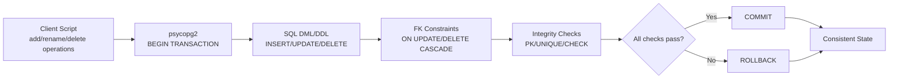
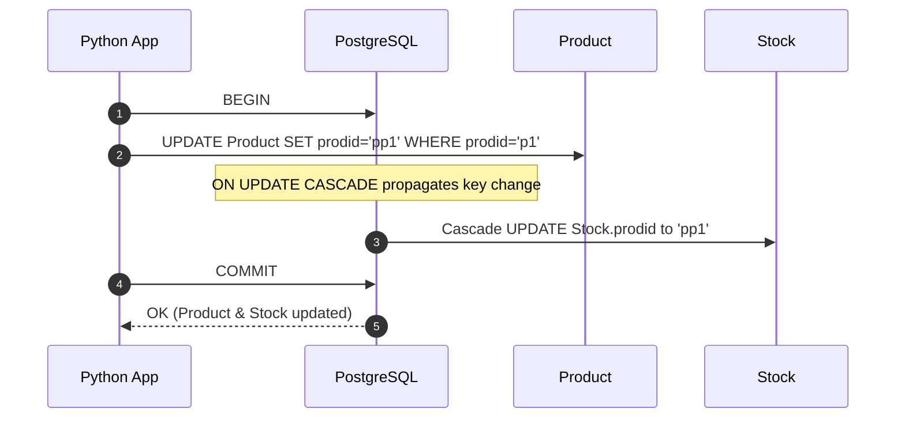
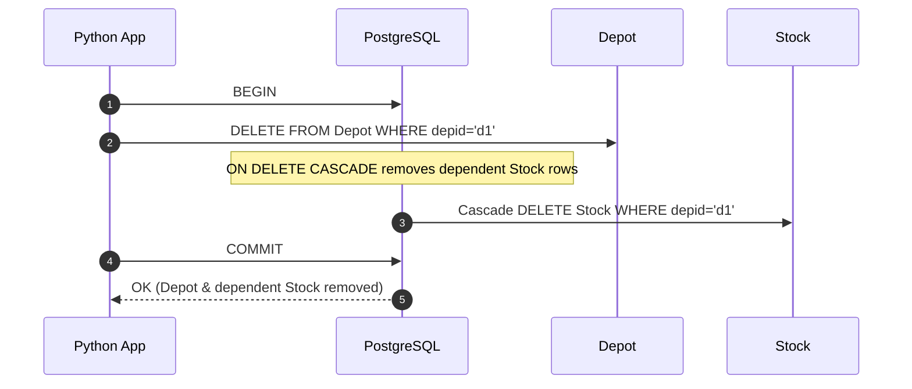

# Database Transactions with PostgreSQL and Python

## Overview
This project demonstrates **production-grade database transactions** in PostgreSQL using Python, with a focus on **ACID** guarantees and **referential integrity**. It covers adding, renaming, and deleting products and depots in a stock management schema while ensuring changes propagate correctly across related tables via **foreign keys** and **ON UPDATE/DELETE CASCADE** rules.

---

## Features
- **Add Products & Stock**: Insert new products into `Product` and corresponding rows into `Stock`.
- **Add Depots & Stock**: Insert new depots into `Depot` and associated rows into `Stock`.
- **Rename Products & Depots**: Update identifiers and cascade changes to dependent rows.
- **Delete Products & Depots**: Remove entities safely while maintaining referential integrity.
- **ACID Compliance**: All operations are executed in transactions with commit/rollback semantics.

---

## Technologies
- **PostgreSQL**
- **Python 3.x**
- **psycopg2** (PostgreSQL adapter for Python)
- **Git**

---

## Prerequisites
- PostgreSQL running locally or remotely
- Python 3.6+
- Install dependencies:
  ```bash
  pip install psycopg2-binary
  ```

---

## Database Setup

### Create Database
```sql
CREATE DATABASE cs623_project;
```

### Create Tables and Seed Data
**Product**
```sql
CREATE TABLE Product (
    prodid CHAR(10) PRIMARY KEY,
    pname  VARCHAR(30),
    price  DECIMAL CHECK (price > 0)
);

INSERT INTO Product (prodid, pname, price) VALUES
('p1', 'tape', 2.5),
('p2', 'tv', 250),
('p3', 'vcr', 80);
```

**Depot**
```sql
CREATE TABLE Depot (
    depid  CHAR(10) PRIMARY KEY,
    addr   VARCHAR(50),
    volume INT
);

INSERT INTO Depot (depid, addr, volume) VALUES
('d1', 'New York', 9000),
('d2', 'Syracuse', 6000),
('d4', 'New York', 2000);
```

**Stock**
```sql
CREATE TABLE Stock (
    prodid   CHAR(10),
    depid    CHAR(10),
    quantity INT,
    PRIMARY KEY (prodid, depid),
    FOREIGN KEY (prodid) REFERENCES Product(prodid) ON UPDATE CASCADE ON DELETE CASCADE,
    FOREIGN KEY (depid)  REFERENCES Depot(depid)   ON UPDATE CASCADE ON DELETE CASCADE
);

INSERT INTO Stock (prodid, depid, quantity) VALUES
('p1', 'd1', 1000),
('p1', 'd2', -100),
('p1', 'd4', 1200),
('p3', 'd1', 3000),
('p3', 'd4', 2000),
('p2', 'd4', 1500),
('p2', 'd1', -400),
('p2', 'd2', 2000);
```

---

## Project Structure
```
cs623_project/
├── db_connection.py   # Connection helper
├── add_product.py     # Adds product & stock
├── add_depot.py       # Adds depot & stock
├── rename_product.py  # Renames product (CASCADE)
├── rename_depot.py    # Renames depot (CASCADE)
├── delete_product.py  # Deletes product (CASCADE)
├── delete_depot.py    # Deletes depot (CASCADE)
└── README.md
```

---

## Configuration
Update `db_connection.py` with your credentials:
```python
import psycopg2

conn = psycopg2.connect(
    dbname="cs623_project",
    user="your_username",
    password="your_password",
    host="localhost",
    port="5432",
)
conn.autocommit = False  # ensure explicit transaction control
```
> Use `conn.commit()` to persist, or `conn.rollback()` to revert on error.

---

## Transaction Flows

### System Pipeline


### Rename Product (p1 → pp1)


### Delete Depot (d1)


---

## Usage
1. Clone the repository:
   ```bash
   git clone https://github.com/USERNAME/cs623_project.git
   cd cs623_project
   ```
2. Run scripts (each script starts and commits/rolls back its own transaction):
   ```bash
   python add_product.py
   python add_depot.py
   python rename_product.py
   python rename_depot.py
   python delete_product.py
   python delete_depot.py
   ```

---

## ACID Guarantees
- **Atomicity**: Each script encloses changes in a transaction; failures trigger rollback.
- **Consistency**: CHECK constraints and FK cascades maintain valid states.
- **Isolation**: Use appropriate isolation level (`READ COMMITTED` default) as needed.
- **Durability**: Committed changes are persisted by PostgreSQL’s WAL.

---

## Contact
**Author:** Sai Teja Kusireddy  
**Email:** tejakusireddy23@gmail.com  
**GitHub:** https://github.com/tejakusireddy

---

## License
MIT License — see `LICENSE`.
